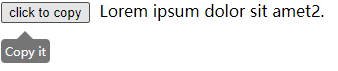
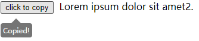

## 介绍

复制文本。





## 下载

### npm

```
npm i copy-to-clipboard
```

### src

```
<script src="../dist/copy-to-clipboard.js"></script>
```

## 使用

### 点击某个元素时复制内容

```html
// 添加copy属性，鼠标点击该div时将复制文本
<div copy>
  Lorem ipsum dolor sit amet.
</div>

// 默认不复制子元素的文本
<div copy>
  Lorem ipsum dolor sit amet.
  <span>
    Lorem ipsum dolor sit amet.
  </span>
</div>

// 添加deep属性，鼠标点击该div时会复制子元素的文本
<div copy deep>
  Lorem ipsum dolor sit amet.
  <span>
    Lorem ipsum dolor sit amet.
  </span>
</div>
```

### 点击某个元素时复制另一个元素的内容

```html
// 被点击元素
<button id="button">
  Copy
</button>

// 被复制元素，可以通过添加deep属性复制到子元素文本
<div id="div" deep>
  Lorem ipsum dolor sit amet.
  <span>
    Lorem ipsum dolor sit amet.
  </span>
</div>
```

```javascript
// import copyToclipBoard from "copy-to-clipboard"

const button = document.getElementById("button")
const div = document.getElementById("div")

copyToClipboard.copy(button, div)
```

